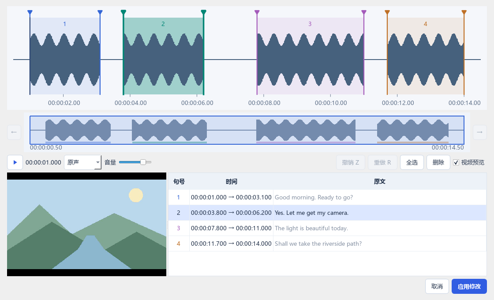

# Voxlate

[中文](README.md)

A local Windows tool for dubbing English or Japanese videos into Simplified Chinese. Edit, preview and regenerate individual lines using a shared voice, per-line voices or fixed voices per character. Setup needs internet access; video processing uses local models. Review the results, starting with a short clip.


*Screenshots show the actual application with fictional dialogue, synthetic waveforms and illustrative resource status.*

## Quick start

1. Open `voxlate.exe`, choose a resource folder in **资源配置** (Resources), and run **一键准备** (Prepare all). The packaged app needs no preinstalled Python; AI environments and models are installed separately.
2. Browse to or drop a video into **视频配音** (Video dubbing). Select **English → Chinese** or **Japanese → Chinese** manually; source language does not switch automatically.
3. Run **① 识别** (Recognize). Check text and timing. Repeating this step asks for confirmation, then replaces manual boundaries, include/discard choices and translations. Successful runs back up the old project in `history/automatic-recognition`; failures preserve it.
4. Run **② 翻译** (Translate). This uses existing sentences without recognition. Double-click translations to edit; changes save automatically. Replacing existing translations asks for confirmation and backs them up in `history/translation`. Each validated batch saves resume progress. After failure or cancellation, unchanged text, context and model settings allow resuming completed batches. Table translations are replaced only when the whole run succeeds; clicking Translate again after success starts a fresh run.
5. Select a voice mode and run **③ 生成配音** (Generate speech). Preview lines; edit and use the red **●** to regenerate a line.
6. Run **④ 导出视频** (Export video). Output defaults to `video-name.zh.mp4` beside the input, with overwrite confirmation. The player offers **原声** (Original audio) comparison and remembers volume.

Translation must exist before dubbing. All selected lines need speech matching the current text and voice settings before export. Export processes existing audio without rerunning recognition, translation or voice cloning.

The blue **一键导出** (One-click export) resumes missing or outdated steps, preserving existing segmentation and valid translations and reusing matching speech. New projects run all four steps with saved checkpoints, so a translation failure does not require recognition again.

For multiple audio tracks, use the dropdown after **清空项目** (Clear project). It shows the number, language, title and channel layout. The first track is the default; selection is remembered inside the video's project folder. Multi-track projects and exports are numbered from `audio-1`, then `audio-2`, etc.; single-track videos have no suffix. Each track keeps separate results. Legacy first-track projects without a suffix are reused in place. Recognition, original previews and export use the selected track; choose the translation source language separately.

## Models and resources


| Purpose | Options | Behavior |
| --- | --- | --- |
| Recognition | Whisper large-v3 / turbo | Separate alternatives with word-level timing; a larger model is not always more accurate |
| Combined recognition | v3 + turbo | Enabled by default; v3-based local cross-checking, not guaranteed better segmentation |
| Recognition | Qwen3-ASR 1.7B + ForcedAligner 0.6B | Separate recognition and alignment; not part of combined recognition |
| Translation | Hy-MT2 7B Q4 | English/Japanese → Chinese with nearby dialogue context |
| Separation | Demucs htdemucs | Separates vocals and background; the automatically installed variant |
| Voice cloning | IndexTTS 2.5 | Generates Chinese speech from voice and per-line emotion references |
| Character grouping | CAMPPlus | Reuses voice-cloning weights for CPU speaker grouping |

Choose one of four recognition modes: v3, turbo, combined recognition, or Qwen. Combined recognition is selected by default and requires both Whisper models. Recognition modes and source languages use separate projects; switching back restores prior results. Hy-MT2 7B is the only translation option; translating again replaces the current translations.

Approximate model sizes: v3 **3.09 GB**, turbo **1.62 GB**, Qwen with alignment **6.54 GB**, Hy-MT2 7B **4.62 GB**, IndexTTS **7.1 GB**. Allow additional space for environments, downloads and project audio. Resources show measured file sizes after setup, not exact disk allocation.

- **Prefer mirrors** defaults on for ordinary Python packages and Hugging Face models, falling back to original hosts. Some sources, including GitHub and PyTorch, still use their original hosts. Logs show the source.
- **Stop** retains completed files. Retrying attempts reuse or resume where supported; otherwise files restart. Percentages are estimates; a quiet log alone does not prove a hang.
- Startup reuses unchanged resource status. Click **Check** after external changes. Changing the resource folder does not move existing installations.
- **Delete…** shows purpose, path and size before confirmation. Reinstallation retrieves the app's specified version; there is no automatic upgrade button.
- PyTorch belongs to an environment, not a language or voice model. Different environments may need different versions. Separation, voice cloning and Qwen have independent environments.
- Select devices in each environment's **Settings…**. CPU support depends on the model, and CPU dubbing can be slow. Enable BF16 only on supported hardware. Moving the EXE does not move its settings or resources.

## Voices and characters

| Mode | Use |
| --- | --- |
| Shared voice | One reference throughout, suitable for one speaker; leave the line number empty for automatic recommendation, or enter a specific number |
| Per-line voice | Each line uses its original vocals; useful for multiple speakers, but short or emotional clips can sound inconsistent |
| Per-character voice | Fixed references reduce variation within each character; automatic groups can be corrected manually |

All modes reference the **current line's original emotion**. A fixed voice does not imply fixed emotion or matching duration. External reference files and video-range selection are currently unavailable in the GUI.

Automatic recommendation considers representativeness, speech proportion, duration and stability within the character with the most dialogue. It is not simply the longest clip or a certified quality score.

When automatic analysis first finds **more than five characters**, **shared voice** switches to per-line voice. Existing per-character or per-line selections remain unchanged. Later manual overrides are respected rather than repeatedly switched back.

Assign lines through the character column. **角色管理…** (Character management) supports renaming, adding, deleting, choosing references and regrouping. The limit is 50 characters with unique names of up to eight characters. Reassign lines before deleting a character in use. Brown assignments indicate uncertainty. Grouping does not identify real people or gender, or split multiple speakers within one line.

Voice schemes retain separate audio caches. Switching does not delete another scheme; renaming does not require regeneration. Changing assignments or references may invalidate affected lines.


## Line controls and export

- **Original text:** click to include/discard; discarded lines are dimmed. Select one or more consecutive time cells, then click **手动分句…** on the right. Hover timestamps for millisecond precision; hover each header title or its **i** icon for help.
- **Original ▶:** plays separated vocals at the original pace.
- **Translation ● / ▶:** the red dot regenerates only that line without confirmation. Play previews existing Chinese speech, preferring aligned audio. Neither line preview includes background.
- **Translate/generate again:** existing results require confirmation. Retranslation reuses unchanged recognition; confirming batch generation regenerates selected lines in the current scheme. Edited text can still preview old audio but needs regeneration before export.
- **White-to-blue gradient:** generated duration divided by the original time window indicates compression demand. It starts above 1.2×, covers one quarter at 1.6× and one half at 2× or more. This is not recognition confidence; tiny windows can exaggerate the ratio.

Export uses absolute timestamps; discarding a line never shifts subsequent dialogue. **Selected intervals use background plus Chinese speech. Discarded intervals, gaps and leading/trailing portions use the unseparated original audio, replacing the entire mixed interval.** Missed speech or a sound incorrectly included inside a selected line's window can still disappear; review that line. The app cannot automatically determine those boundaries.

MP4 output includes a default Chinese track and the selected original track. Compatible video is copied; otherwise it is transcoded to H.264. Audio is converted to stereo AAC, so export is not lossless. The first main video is processed; preservation of all subtitles, chapters and other audio tracks is not promised.

## Manual segmentation



Select one time cell or drag across consecutive rows, then click **手动分句…** immediately beside the selection. The waveform shows only that range plus half of the blank gap on each side, with existing boundaries.

- Drag across blank waveform space in either direction to add a sentence. Drag sentence edges to adjust timing. Up to **10 sentences**; new ranges cannot overlap existing ones.
- Selected sentences have darker backgrounds and thicker boundaries. Use the trash icon at the right of the source text, or **D / Delete**, to remove a whole sentence. **Z** undoes; **R** redoes. Deleted ranges retain original audio without shifting later audio.
- Double-click a waveform sentence or click **▶** to preview. The button becomes **■** during playback; click again to stop. Space also plays/stops. Original audio is the default; separated vocals are optional. The track choice also controls recognition.
- Use the wheel to zoom and fit-range to restore the view. Extend one sentence left/right to include a whole neighbor. Each edit is limited to ten minutes.

Apply recognizes and translates only **new ranges or changed boundaries**, sharing model loading across the batch and keeping each range as exactly one sentence. Unchanged source text, translations, include/discard choices, characters and speech remain intact. Deletion alone calls no models; applying without changes does nothing. New ranges with no recognized text are discarded and retain original audio, with a count shown in the main window. Qwen skips alignment; combined mode uses v3 text with turbo filling empty results.

Generate speech for new or changed sentences. Removing or changing a voice reference may also require regenerating related speech. Recognition errors, translation failure or cancellation keep the project unchanged, with a recoverable draft. Changed projects are backed up in `history/manual-segments`; drafts, waveforms and task files stay in project `.temp`. Canceling the editor makes no project changes. To restore an entire previous project, close the app and replace `project.json` with the corresponding backup.

## Files and cleanup

Selecting the same video reopens the project for its current language and recognition mode:

```text
movie.mkv
movie.zh.mp4
movie.mkv.voxlate/
  en-combined/             # Or en-whisper-large-v3-turbo, ja-qwen3-asr-1.7b, etc.
    project.json           # Text, timing, characters and audio pointers
    original.wav           # Unseparated source audio
    separated/             # Vocals and background
    recognition/           # Recognition comparisons and voice analysis
    segments/              # Original, generated and aligned clips
    .temp/                 # Project-local scratch files
    run.log / tts.log / ... # Progress, model lifecycle, timing and errors
```

**Open project folder** opens `movie.mkv.voxlate`. **Clear project** asks for confirmation, then removes all its recognition profiles, voice versions and temporary data, keeping the input and exported video. Projects are not automatically deleted. Translation scratch directories normally disappear after the task. Unfinished batch progress remains in the project's `.temp/translation-resume.json` until success; forced termination can leave other project-local remnants.

Legacy multi-track projects remain accessible when the new numbered directory has no `project.json` and is not locked. If the newly named export is absent, playback uses the old export path recorded by the current project, without changing the old file.

Settings default to `%LOCALAPPDATA%\voxlate\config.json`; volume is in `player-settings.json` beside it. Shared resources default to `resources`, support code to `support`. Use `voxlate.exe --data-dir D:\voxlate-data` for another data folder. Project content does not belong in the app settings folder. Detailed model logs may contain dialogue and local paths; inspect them before sharing.

Inference does not call external translation or speech services. Hy-MT2 communicates with a local model process only through `127.0.0.1`, not the LAN. Prompts, scratch files and working directories stay inside the project. Download hosts are accessed during resource preparation.

## Runtime behavior and limitations

- The GUI keeps IndexTTS loaded after synthesis for subsequent batch or single-line use, occupying VRAM. **Release models** frees it; later synthesis reloads it. Switching projects, starting recognition/translation, stopping dubbing or exiting also releases it.
- Translation loads once per task, processes all batches, then releases the model. Logs contain model names and stage/task durations. Dubbing progress counts completed lines, not remaining time.
- Lists remain scrollable during processing while edits/settings are locked. Stopping preserves completed work. If forced termination leaves a `.lock`, confirm the old process has exited before handling the lock file.
- Incompatible recognition or separation settings are rejected before replacing results. Restore previous settings to continue, or back up and clear the project to restart. Recognition modes already have separate projects.
- Recognition may miss, repeat, mis-segment or mis-time dialogue. Combined recognition is not guaranteed better; contextual translation can move meaning between rows. Complete meaning and correct speaker turns matter more than simply producing smaller fragments.
- Synthesis uses random sampling. Long references, text and VRAM pressure can affect duration and speed; one outlier does not establish a stable performance ranking. `duration_factor` remains experimental; production uses 1.0.
- Manual segmentation cannot separate two people speaking simultaneously and does not provide lip synchronization. Long videos and Japanese dialogue need further validation; successful processing/tests do not certify content quality.

Priorities in [TODO](TODO.md): segmentation usability, unusually slow synthesis, and character-grouping validation.

## Development and verification

### Run from source or build an EXE

Install **64-bit Python 3.12 on Windows**. Download and extract the source ZIP, or clone with Git, then open PowerShell in the project root containing `voxlate.spec`. Keep the full source tree, including `assets/`, `scripts/`, `voxlate/`, and the root configuration, dependency lists and documentation.

```powershell
py -3.12 -m venv .venv-build
.\.venv-build\Scripts\python.exe -m pip install -r requirements-build.txt

# Run from source
.\.venv-build\Scripts\python.exe voxlate_gui.py

# Close the source window, then build the EXE
.\.venv-build\Scripts\python.exe -m PyInstaller --noconfirm --distpath dist/updated voxlate.spec
```

Output: `dist/updated/voxlate.exe`. No virtual-environment activation is needed. If `py` is unavailable, use the full Python 3.12 path in the first command. Close any EXE running at the output path before rebuilding. Alternatively, `scripts/build_windows.ps1 -Python .\.venv-build\Scripts\python.exe` installs build dependencies and packages the app.

Building needs only GUI and packaging dependencies, not AI models or the developer's `.build-deps/` folder. The EXE excludes models, FFmpeg and AI environments. Use **Resources → Prepare all** after startup, or select an existing resource folder. The app manages AI environments independently of the build environment.

### Developer checks

```powershell
.\.venv-build\Scripts\python.exe -m unittest discover -s tests -v
.\.venv-build\Scripts\python.exe scripts/capture_readme.py
```

Tests use synthetic media and model stand-ins; FFmpeg integration tests require FFmpeg / FFprobe. Coverage includes workflow, caches, cancellation/recovery, original audio, cleanup and UI, not real-model accuracy. The screenshot script updates `docs/images/` without loading models or reading user videos, and removes its own scratch data. Use `scripts/check_translation_paths.py --engine <path-to-llama-server.exe>` to check native startup in Chinese, Japanese, English and special-character paths.

Commit `voxlate/`, `tests/`, `scripts/`, `assets/`, `docs/images/`, dependency lists, the configuration template and documentation. `temp/` holds disposable development experiments, `build/` holds reproducible packaging caches, and `dist/` holds local builds. These directories, media, video projects and model weights are excluded by `.gitignore`. Keep `.build-deps/` locally to reuse build dependencies. Review the file list before committing; exclude real dialogue, personal paths and credentials. Distribute the EXE separately as a release asset.

The CLI uses the specified configuration and the same default project location as the GUI. Source-tree `config.json` is a template, not an automatic reference to installed GUI settings:

```powershell
python main.py --config "$env:LOCALAPPDATA\voxlate\config.json" --doctor
python main.py "D:\videos\movie.mkv" --config "$env:LOCALAPPDATA\voxlate\config.json" --source-lang ja --stop-after translate
```

Use `--stop-after recognize` to save recognition only, `--translate-only` to translate saved sentences, or `--auto-export` to resume through export. The existing `--stop-after translate` still means recognize and translate, then pause.

Use `--audio-track 2` for the second audio track (numbering starts at 1); use the same number for subsequent steps.

Experiments, statistics and previews derived from real media must also stay inside that video's `.voxlate` project, never repository `temp`, system temporary folders or shared model directories.
