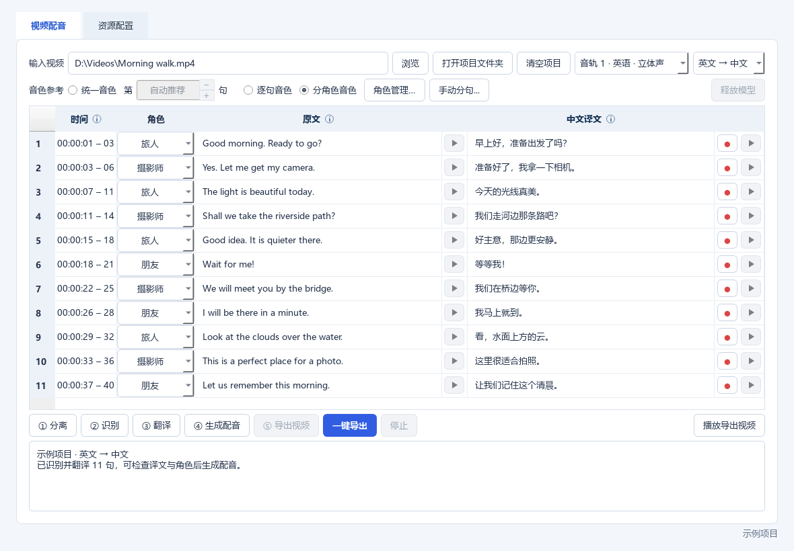
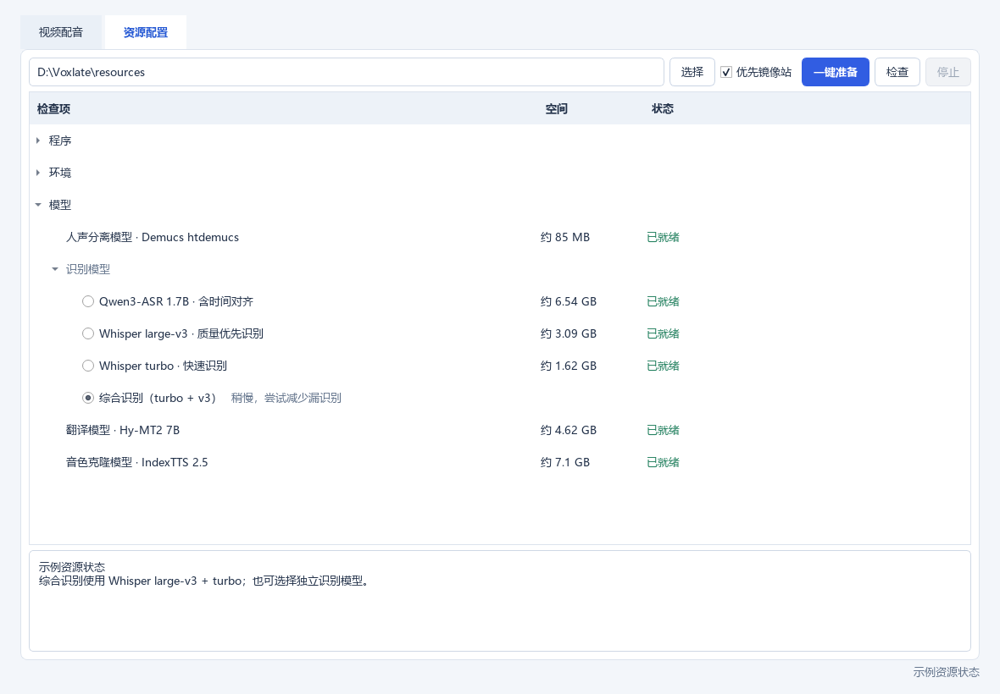
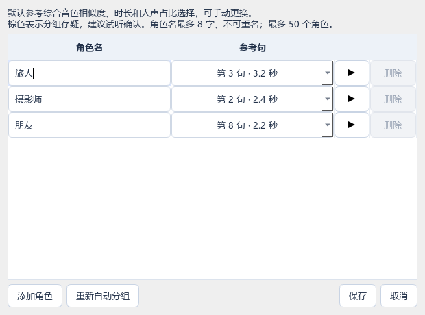
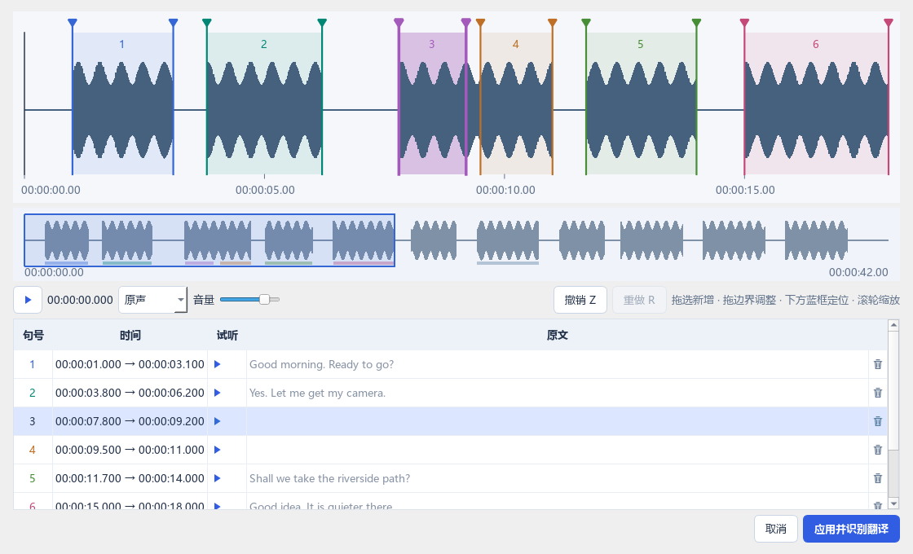

# Voxlate

**给视频换一种语言，保留音色，逐句试听、修改和重配。** Windows 本地视频配音工具。

> **版本说明：** 已发布的 [v0.1.0-beta.2](https://github.com/redimocteer/voxlate/releases/tag/v0.1.0-beta.2) 固定支持 **英文 / 日文 → 简体中文**，原下载包保持不变。当前 `feature/three-language` 开发分支（`0.2.0-dev`）接入 **中、英、日六向互转**；以下操作以开发版为准。保存基线和验证范围见 [版本里程碑](docs/MILESTONES.md)。

[下载与安装](docs/DOWNLOAD.md) · [界面演示](#界面演示) · [硬件要求](#硬件要求) · [使用方法](#快速开始) · [反馈问题](https://github.com/redimocteer/voxlate/issues)

## 下载与安装

从 [v0.1.0-beta.2 测试版](https://github.com/redimocteer/voxlate/releases/tag/v0.1.0-beta.2) 下载 **`Voxlate-v0.1.0-beta.2-windows-x64.zip`**，完整解压后运行 `voxlate.exe`；普通用户不需要安装 Python 或学习构建。不要下载页面自动生成的 `Source code` 来当安装包。

首次进入 **资源配置 → 一键准备** 下载模型与运行环境，然后拖入视频，选择音轨及语言方向。点击 **一键导出**，或按 **分离 → 识别 → 翻译 → 生成配音 → 导出视频** 五步校对。详细说明见[下载与安装](docs/DOWNLOAD.md)。

模型和外部推理环境由用户决定是否从上游下载，不随程序分发。开发版下载前可逐项查看来源、许可并取消选择；详见[第三方资源与下载选择](docs/RESOURCE_DOWNLOADS.md)。旧测试版不含新增的下载确认和随导出说明功能。

## 硬件要求

| 项目 | 当前要求与限制 |
| --- | --- |
| 系统 | 64 位 Windows；其他系统未提供安装包 |
| 显卡 | 默认流程使用 NVIDIA CUDA 显卡，需安装适用驱动；AMD、Intel 与纯 CPU 全流程尚未验证 |
| 内存／显存 | 尚未完成最低配置测试，不承诺固定容量即可流畅处理；请先试短片 |
| 磁盘 | 模型与环境需数十 GB，另留视频项目与导出空间；模型不包含在程序 ZIP 中 |
| 网络 | 首次准备资源需联网；识别、翻译与配音在本地运行 |

适合愿意试听、修正自动结果的用户；不保证嘴型同步。新语言方向仍需真实素材试听校对，当前以测试和反馈为主。

## 界面演示



*这是实际程序界面，使用虚构对白与合成波形；不是配音效果演示。音视频效果演示暂未提供。更多：[手动分句](#手动分句) · [角色管理](#音色与角色) · [资源配置](#模型与资源)。*

本项目原创源码采用 [MIT](LICENSE)；第三方模型与素材另有授权要求，详见文末「许可与使用责任」。

## 快速开始

1. 打开 `voxlate.exe`，进入 **资源配置**，选择空间足够的资源目录，点击 **一键准备**。查看各项来源与许可，确认后下载所选资源；也可自行准备并指定路径。发行 EXE 不要求预装 Python，模型和运行环境另外安装。
2. 在 **视频配音** 中浏览或拖入视频，选择语言方向：**英→中、日→中、中→英、日→英、中→日、英→日**；目前不自动判断源语言。界面保持中文，译文栏随目标语言变化。
3. 点击 **① 分离**，提取所选音轨并分离人声与背景；已有匹配结果时直接复用，不加载识别模型。
4. 点击 **② 识别**，识别已准备的人声，检查原文和时间。Qwen 自动续接已完成的识别块和时间对齐；音频、模型及配置必须匹配。要从头识别，先停止任务，再删除当前识别项目下的 `recognition/` 文件夹；旧版无校验缓存会重新建立。其他识别模型暂不支持块级续跑。已有句子时，确认后用自动结果替换手动分句、选弃和译文，成功时备份到 `history/automatic-recognition`，失败保留原结果。
5. 点击 **③ 翻译**，只翻译已有句子，不重新识别。双击译文修改，自动保存。已有译文时会确认覆盖，并备份到 `history/translation`。每批通过校验后保存续传进度；失败或停止后，原文、上下文和模型设置未变即可接着翻译。整轮成功才替换主界面译文，成功后再次点击仍会重新翻译。
6. 选择音色模式，点击 **④ 生成配音**。逐句试听，修改译文后可用该句红色 **●** 重配。
7. 点击 **⑤ 导出视频**。默认输出到原视频旁的 `视频名.en-zh.mp4`（英→中）或 `视频名.zh-en.mp4`（中→英）等，覆盖已有文件会确认。播放器可切换 **原声** 对比，音量会保存。

先有译文才能配音；所有已选句子的配音与当前设置一致后才能导出。导出只处理已有音频，不重新运行识别、翻译或音色克隆。

翻译包含已舍弃的句子。选取／舍弃只决定是否配音，舍弃处仍使用原声，便于参考译文后决定是否重新选取。

Qwen 优先避免错误配音：无法对齐、定位存疑、大量词语时长为零或单词被异常拉长时，自动保留原声、不参与配音，候选文字仍可查看，其他句子继续处理。可能因此少配部分真实对白；这是保守的时间检查，不是模型置信度，也不能保证识别出全部假台词。旧识别缓存也会在下次识别时套用检查，无需删除缓存；异常对齐结果留在项目 `recognition/` 内。

Qwen 自动识别保留常规约 20～30 秒的输入块；生成过慢时缩至约 8～12 秒，必要时继续缩短，优先在低音量处切分。模型保持加载，块间释放闲置显存；超时截断的文字不会保存，仍失败则保留进度并停止。旧版已完成块可以继续复用。切块不是精确语音边界，仍需核对漏词、重复及背景音乐误识别。

蓝色 **一键导出** 自动接续缺少或失效的步骤：保留已有分句和有效译文，复用匹配的配音。新项目依次完成五步，每步保存结果；不会因为翻译失败而要求重跑识别。

视频有多条音轨时，可在 **清空项目** 后的下拉框选择，显示编号、语言、名称和声道格式。默认第一条；选择会记在视频项目内。多音轨项目和导出文件从第一条起标注 `audio-1`、`audio-2` 等编号，单音轨不加后缀。不同音轨的结果独立保存，切回可继续；旧的无后缀第一音轨项目仍在原位置复用。识别、原声试听及导出均使用所选音轨，翻译源语言仍需手动选择。

## 模型与资源



| 用途 | 当前选项 | 说明 |
| --- | --- | --- |
| 识别 | Whisper large-v3 / turbo | 独立选择，使用词级时间确定句子范围；大模型不保证每段都更准 |
| 综合识别 | v3 + turbo | 默认开启；以 v3 为基础局部对照补漏，不保证分句更好 |
| 识别 | Qwen3-ASR 1.7B + ForcedAligner 0.6B | 独立识别与时间对齐，不参与综合识别 |
| 翻译 | Hy-MT2 7B Q4 | 支持中、英、日互译及附近对白上下文 |
| 人声分离 | Demucs htdemucs | 分离原人声与背景；自动安装使用此版本 |
| 音色克隆 | IndexTTS 2.5 | 参考音色和逐句情绪合成中、英、日语音 |
| 角色分组 | CAMPPlus | 复用音色克隆资源中的权重，在 CPU 上进行声纹分组 |

v3、turbo、综合识别和 Qwen 为一组单选项，默认选择综合识别，需要同时准备 v3 和 turbo。切换识别模式或语言方向使用独立项目，切回可继续旧结果。翻译目前仅提供 Hy-MT2 7B，重新翻译会替换当前译文。

模型约占：v3 **3.09 GB**、turbo **1.62 GB**、Qwen 含对齐模型 **6.54 GB**、Hy-MT2 7B **4.62 GB**、IndexTTS **7.1 GB**。还需预留环境、安装缓存和项目音频空间。资源页准备后更新实测文件大小；文件大小合计不等于实际磁盘占用。

- **优先镜像站** 默认开启：普通 Python 依赖和 Hugging Face 模型优先尝试镜像，失败再试原站。GitHub、PyTorch 等部分来源仍用原站，日志显示来源。
- **停止** 保留已完成文件；再次准备尝试复用或续传，不支持时重下。百分比是估算，无新增日志不等于卡死。
- 启动及切换模型、设备时沿用上次资源状态，开始处理时只检查当前步骤所需资源。点击 **检查**可完整刷新；更换资源目录会确认新位置的资源，不会自动搬迁旧资源。
- **删除…** 展示用途、路径和大小，确认后删除本项；随后可重新安装应用指定版本，没有自动升级按钮。
- PyTorch 属于运行环境，不是语言或音色模型；不同环境可能需要不同版本。人声分离、音色克隆和 Qwen 各有独立环境。
- 在环境 **设置…** 中选择设备；CPU 支持取决于模型，CPU 配音可能很慢。BF16 仅在显卡支持时开启。EXE 可移动，但外部配置与资源不会随之移动。

## 音色与角色

| 模式 | 用法 |
| --- | --- |
| 统一音色 | 全片固定参考音色，适合单人；参考句留空为“自动推荐”，也可填写句号 |
| 逐句音色（新项目默认） | 每句参考自身原人声，适合多人；短句及情绪变化可能造成音色不稳定 |
| 分角色音色 | 每个角色固定参考句，减少同角色音色差异；自动分组后可手动修正 |

三种模式都参考 **当前句原声的情绪**。固定音色不等于固定情绪，也不保证时长一致。GUI 暂不提供外部参考音频或视频框选音色。

自动推荐从对白最多的角色中，综合代表性、人声占比、时长和稳定性选参考句，不简单选最长句，也不是音质认证。

首次自动分析发现 **超过 5 个角色**，且当前选 **统一音色** 时，切到逐句音色；已选分角色或逐句音色则保持。之后手动改回的选择会保留，不反复自动切换。

分角色模式下，每句可在角色列改派。**角色管理…** 支持改名、添加、删除、选参考句及重新自动分组；最多 50 个角色，名称最多 8 字且不重复。使用中的角色先改派句子才能删除。棕色分配表示存疑，建议试听确认；分组不识别真实身份或性别，也不能拆分一句内的多人对白。



三种音色方案分别保留配音缓存。切换不会删除另一方案；角色改名不重配，更改角色分配或参考句可能需要重配受影响句子。

## 逐句操作与导出

- **原文列**：点击选取 / 舍弃，变淡表示舍弃。时间列单击或拖选连续几句，再点击右侧“手动微调…”，悬浮时间显示毫秒精度。鼠标放在栏名或旁边的 **i** 上可查看操作说明。
- **原文 ▶**：试听分离后的人声，保持原始语速。
- **试听进度**：播放原声或配音时，时间格的淡蓝色背景向右缩短，表示剩余时长；再次点击播放按钮可停止。连续试听会复用已打开的音频。
- **译文 ● / ▶**：红点强制重配此句，不询问确认；播放按钮试听已有中文配音，优先使用对齐版本。两种逐句试听都不混入背景。
- **复制文字**：在原文或译文列拖动框选，按 `Ctrl+C` 复制；多句按行、原文和译文按两列排列。`Ctrl+单击` 可选中单个或不连续的文字格，不改变句子的选取／舍弃状态。
- **重新翻译 / 整批配音**：已有结果先确认覆盖。重新翻译复用未变动的识别结果；整批配音确认后重配当前方案的已选句子。改过译文仍可试听旧配音，但更新后才能导出。
- **白蓝渐变**：合成后按“配音时长 ÷ 原句时间”提示压缩需求。超过 1.2× 开始，1.6× 占格子 1/4，2× 及以上占 1/2；不是识别置信度，极短句比例可能夸大听感问题。

导出按绝对时间放置配音，舍弃句子不会让后续对白前移。**已选范围使用背景＋中文配音；舍弃范围、句间空隙及片头片尾直接使用未分离原音轨，替换整个混音片段。** 漏掉的对白或狗叫若被错误划入已选句子的时间范围，仍可能消失，需要检查该句，目前不能自动判断这种情况。

MP4 包含默认中文音轨和所选原声音轨。视频优先直接复制，编码不兼容 MP4 时转 H.264；音频转为立体声 AAC，最终导出不是无损音频。处理首个主视频轨，不承诺保留输入的所有字幕、章节和其他音轨。

## 手动分句

- **全片手动分句**：完成分离后，点击“角色管理…”右侧的 **手动分句…**。从空白时间轴重新划句，不带入已有识别边界；应用后替换全片结果，未划选处保留原声。
- **局部手动微调**：单击时间或拖选连续几句，点击选区紧邻右侧的 **手动微调…**。带入所选句子的边界，并包含两侧各一半空白。



- 在空白处拖选范围，松开就新增一句；左右方向均可，选框透明。拖动任一边界后，停止试听并将播放指针移回该句左边界。新增范围不能与已有句子重叠。
- 点击句子选中，背景加深、边界加粗。点击原文右侧垃圾桶，或按 **D / Delete** 删除整句；**Z** 撤销、**R** 重做。删除处保留原声，不移动后续时间。
- 双击波形中的句子或点 **▶** 试听，播放时按钮变为 **■**，再次点击停止。空格控制播放／停止。默认原声，可切换分离人声；所选音轨也用于识别。
- 上方大波形显示细节，下方小波形显示整个编辑范围。拖动蓝框或点击小波形定位，滚轮缩放；窗口可最大化。句子颜色循环使用，相邻句颜色不同。
- 局部微调最多 **10 句 / 10 分钟**；全片模式最多 **5000 句**，每句不超过 10 分钟。长视频按需读取详细波形，不将整段音频载入内存。

应用时只识别翻译**新增或边界改变**的句子，批量复用模型加载，每个范围固定为一句。未改动的原文、译文、选弃、角色和配音保留；仅删除时不调用模型，没有修改则直接返回。未识别到文字的新段落自动舍弃并保留原声，返回主界面后提示数量。Qwen 无需时间对齐模型；综合模式以 v3 文字为主，turbo 补充空句。

新增或调整后的句子需要生成配音；若删除或修改了音色参考句，相关配音可能也需重做。识别程序报错、翻译失败或取消时不覆盖项目，下次可恢复草稿。修改前的项目自动备份到 `history/manual-segments`，草稿、波形和任务文件均在项目 `.temp` 中。取消编辑窗口不修改项目。恢复整个旧项目时，可在关闭程序后用对应备份替换当前 `project.json`。

## 文件位置与清理

重新选择同一视频会打开当前语言方向、识别模式对应的已有项目：

```text
movie.mkv
movie.en-zh.mp4
movie.mkv.voxlate/
  en-combined/             # 英→中；沿用旧目录
  zh-en-combined/          # 中→英；其余新方向同样带源和目标代码
  en-ja-combined/          # 英→日；下列内容在每个方向内独立保存
    project.json           # 原文、译文、时间、角色与配音索引
    original.wav           # 未分离原音轨
    separated/             # 人声与背景
    recognition/           # 识别对照、声纹分析
    export-notices/         # 分享配音前的说明、模型协议与来源
    segments/              # 单句原声、配音及对齐音频
    .temp/                 # 项目内临时资料
    run.log / tts.log / ... # 过程、模型加载释放、耗时及错误
```

**打开项目文件夹** 打开 `movie.mkv.voxlate`。**清空项目** 经确认删除该视频所有语言方向、识别模式、音色版本和临时资料，保留原视频与导出视频。项目不会自动删除；翻译临时目录通常在任务结束后清理，未完成的批次进度保存在项目 `.temp/translation-resume.json`，成功后清除。强制终止可能留下项目内残留。

多音轨旧项目兼容：新的编号目录尚无 `project.json` 且未被占用时，继续读取原无后缀项目；播放时若新命名文件尚不存在，使用当前项目记录的旧导出路径，不修改旧文件。

自动识别时，仅对超过 8 秒、词语时间可靠的长句尝试按标点和停顿细分，无需额外加载模型。没有可靠切分点的句子完整保留；时间定位存疑的 Qwen 句子继续保留候选文字和原声。打开旧项目、翻译、配音及手动分句不会触发这项自动细分。

搬迁时将视频和同名 `.voxlate` 文件夹一起移动，保留文件名和项目内部结构。重新拖入视频或打开项目后，会核对视频内容并自动更新项目内的音频路径，继续复用识别、翻译及各音色的配音结果。外部音色文件和自定义导出位置不会自动搬迁。

配置默认在 `%LOCALAPPDATA%\voxlate\config.json`，播放器音量在同目录 `player-settings.json`；共享资源默认在 `resources`，支持代码在 `support`。可用 `voxlate.exe --data-dir D:\voxlate-data` 指定数据目录。项目内容不放在应用配置目录；详细模型日志可能含对白和本地路径，分享前请查看。

`0.2.0-dev` 开发版使用独立的 `%LOCALAPPDATA%\voxlate-dev` 设置目录，首次启动读取旧版资源配置来复用模型，不修改旧版配置。窗口标题带开发版本号。

推理不调用外部翻译或语音服务。Hy-MT2 仅通过 `127.0.0.1` 与本机模型进程通信，不开放局域网；提示词、临时文件和工作目录均在项目内。准备资源时才访问下载站。

## 运行状态与已知限制

- GUI 配音后保留 IndexTTS 模型，后续整批或单句复用，也继续占显存。**释放模型** 可腾出显存，下次需重新加载；切换项目、开始识别翻译、停止配音或退出也会释放。
- 翻译每次任务只加载一次，连续处理各批后释放。日志记录模型名称及阶段、整次任务耗时；配音百分比按句数计算，不代表剩余时间。
- 处理中可滚动查看，编辑和设置锁定；停止保留已完成结果。强制退出留下 `.lock` 时，须确认旧进程已退出再处理锁文件。
- 修改已有项目的识别或分离设置后，程序拒绝混用结果。恢复原设置可继续；如需从头处理，先备份再清空项目。不同识别模式的项目自动分开。
- 识别可能漏词、重复、断句或时间不准，综合识别不保证更好；上下文翻译也可能跨行挪动意思。分句要重视完整语义和说话轮次，不是越碎越好。
- 配音有随机采样；长参考、长译文及显存压力可能影响时长和耗时。单次异常不能当作稳定性能排名。`duration_factor` 仅用于开发对比，正式流程保持 1.0。
- 手动分句不能分离同一时刻交错说话的两个人，也不提供嘴型同步。长视频和日文效果仍需更多验证；任务完成和测试通过不代表内容质量合格。

后续重点见 [TODO](TODO.md)：分句编辑体验改进、异常慢句排查、角色分组验证。

## 许可与使用责任

Voxlate 是个人兴趣开发、免费开源分享的项目，目前不收费、不接受打赏，也不提供托管配音服务。这是维护者的项目定位，不是“仅限非商业使用”的许可限制；原创部分仍按 MIT 授权。不盈利不免除第三方许可、素材授权及依法应承担的责任。

- **本项目授权**：Voxlate 贡献者有权授权的原创代码与文档采用 [MIT 许可证](LICENSE)，允许修改、分发及商用，须保留版权与许可声明。第三方代码、模型权重、运行环境、商标及用户素材不因此改为 MIT。完整来源与注意事项见 [第三方说明](THIRD_PARTY_NOTICES.md)。
- **第三方与商用**：公开下载不等于不受限制。Hy-MT2 固定版本正文为 Apache 2.0；IndexTTS 采用 bilibili 专用模型协议，包含规模门槛、输出／衍生物及再分发条件。程序不分发权重整合包；下载由用户在了解条款后决定。分享配音时请核对实际模型协议，并保留项目 `export-notices/` 中的适用材料、落实下游义务；程序附说明不等于代办授权或确保所有条款已满足。
- **视频与声音权利**：请使用自己拥有相应权利、已获必要授权或具有其他合法依据的视频、字幕、音乐和声音。持有视频文件、订阅观看、个人研究或不盈利，不自动取得翻译、改编、配音或公开传播的授权。克隆他人声音需另行确认声音、人格与隐私等相关权利；不得冒充本人或虚构其认可。
- **AI 开发与输出**：项目主要在 AI 辅助下开发，并经人工选择、调整和测试；这不是代码完全原创、无漏洞或不侵权的证明。识别、翻译、角色分组和配音可能出错，发布或交付前应人工核对。输出权利取决于素材、模型条款及适用法律，不因使用本工具而自动归属于用户或获得商用许可。
- **发布与标识**：公开分享生成配音时，应按适用法律和平台规则主动声明、使用平台的 AI 标识功能，避免让人误认为原说话者真实发言；不得恶意移除已有的生成合成标识。程序目前不保证自动写入符合各地要求的标识。是否属于相关服务提供者或技术支持者，取决于实际提供方式，不能仅凭“免费、开源、离线”认定豁免。
- **责任边界**：软件按现状提供；在适用法律允许的范围内，不保证准确性、适用性、持续可用或不侵权，责任限制以 MIT 及适用法律为准。用户应备份重要资料并核实其用途的合法性。本说明不排除依法不得排除的责任，不替代专业法律意见，也不代表任何上游团队的认可或背书。

发现仓库、附件或示例中的权利问题，可通过 [Issues](https://github.com/redimocteer/voxlate/issues) 提供具体位置和权利依据，维护者将核查处理；请勿公开上传身份证明、未授权素材、完整项目或含个人信息的日志。

已核对内容与待办见[许可与责任复查](docs/LEGAL_REVIEW.md)。具体争议或对外服务的适用义务，应就实际场景咨询有资质的法律专业人士。相关依据包括 [著作权法](https://zscqj.beijing.gov.cn/zscqj/zwgk/flfg18/436481084/index.html)、[民法典](https://www.court.gov.cn/zixun/xiangqing/233181.html)以及[生成合成内容标识办法](https://www.cac.gov.cn/2025-03/14/c_1743654684782215.htm)；其他地区的使用还需核对当地规则。

## 开发与验证

### 从源码运行或构建 EXE

在 Windows 上安装 **64 位 Python 3.12**，下载源码 ZIP 并解压，或用 Git 克隆；进入含 `voxlate.spec` 的项目根目录打开 PowerShell。完整源码需包含 `assets/`、`scripts/`、`voxlate/` 和根目录配置、依赖与文档。

```powershell
py -3.12 -m venv .venv-build
.\.venv-build\Scripts\python.exe -m pip install -r requirements-build.txt

# 直接运行源码
.\.venv-build\Scripts\python.exe voxlate_gui.py

# 关闭源码窗口后构建 EXE
.\.venv-build\Scripts\python.exe -m PyInstaller --noconfirm --distpath dist/updated voxlate.spec
```

构建结果是 `dist/updated/voxlate.exe`。这些命令无需激活虚拟环境；如果没有 `py` 命令，首行改用 Python 3.12 的完整路径。更新构建前先关闭同路径的 EXE，避免文件占用。也可用 `scripts/build_windows.ps1 -Python .\.venv-build\Scripts\python.exe` 安装构建依赖并打包。

构建只需要 GUI 与打包依赖，不要求先下载 AI 模型，也不依赖本机 `.build-deps/`。EXE 不包含模型、FFmpeg 和 AI 环境；启动后通过 **资源配置 → 一键准备** 安装，或选择已有资源目录。AI 环境由应用单独管理，不使用构建虚拟环境。

### 开发验证

```powershell
.\.venv-build\Scripts\python.exe -m unittest discover -s tests -v
.\.venv-build\Scripts\python.exe scripts/capture_readme.py
```

测试使用合成素材和模型替身，FFmpeg 集成测试需要 FFmpeg / FFprobe；覆盖流程、缓存、停止恢复、原声保留、清理和界面，不评价真实模型准确率。截图脚本不加载模型、不读取用户视频，更新 `docs/images/` 后自动清理自己的临时数据。可用 `scripts/check_translation_paths.py --engine <llama-server.exe路径>` 验证中英日及特殊字符目录下的翻译程序启动。

源码提交包含 `voxlate/`、`tests/`、`scripts/`、`assets/`、`docs/images/`、依赖清单、配置模板和文档。`temp/` 为可清理的开发试验资料，`build/` 为可重建的打包缓存，`dist/` 为本地成品；这些目录以及媒体、视频项目和模型权重均由 `.gitignore` 排除。`.build-deps/` 是本机打包依赖，可保留复用。提交前检查文件清单，勿包含真实对白、个人路径或凭据；EXE 单独作为发行附件。

命令行使用指定配置，默认项目位置与 GUI 一致；源码目录的 `config.json` 是模板，不自动读取 GUI 配置：

```powershell
python main.py --config "$env:LOCALAPPDATA\voxlate\config.json" --doctor
python main.py "D:\videos\movie.mkv" --config "$env:LOCALAPPDATA\voxlate\config.json" --source-lang ja --stop-after translate
```

`--stop-after separate` 只完成人声分离；`--stop-after recognize` 按需分离并识别后暂停；`--translate-only` 仅翻译已有句子；`--auto-export` 接续已有结果导出。原有 `--stop-after translate` 仍表示识别并翻译后暂停。

`--audio-track 2` 选择第二条音轨（从 1 开始）；后续步骤使用同一编号。

真实素材的开发测试、统计和试听文件也必须放在该视频的 `.voxlate` 内，不放仓库 `temp`、系统临时目录或共享模型目录。

首次备份到 GitHub 可按[逐步操作说明](docs/GITHUB.md)进行；对外发行 EXE 前还需完成[发行检查](docs/RELEASE_REVIEW.md)。
